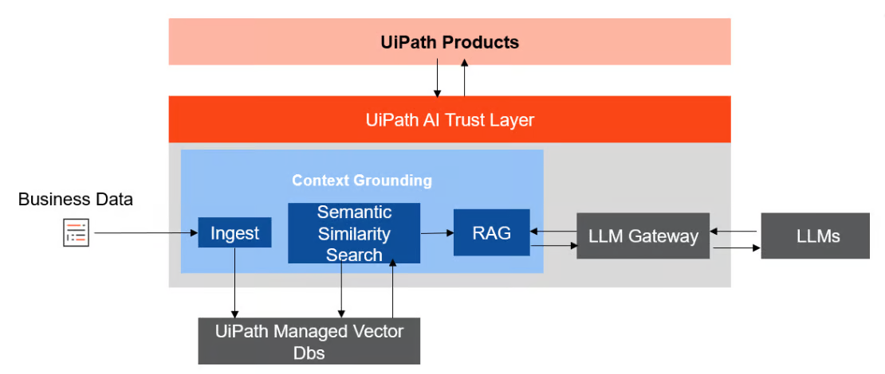

一眨眼就快要斷更四個月了，也是又一個季節終了。
學期中忙於適應、調整自己，和傾頹與振作相互溝通，臨近期末又被困頓打敗，憤而逃離，想要梳理前些日子短暫紀錄的想法，透過洋洋灑灑又輕巧地描繪現世以獲得短暫的成就感，來去填補期末與週末將離的空虛。

---

## 近況更新

在提起「AI 工具」一詞的時候你會想到什麼？

$\;$

九月份我開始了人生中第二份實習。新公司主張「AI x 自動化」，是一間有些許年份但正在經歷轉型新創。組織腳步雖快，但不會給實習生太多壓力。團隊很小，女生居多，彼此緊密又充滿歡笑與關懷。入職後一切都順利不過，恰巧公司正在擴編，我甚至向上一份實習的同事推薦了我們的公司，問他要不要一起玩。若有任何人問起，我幾乎找不到能夠指摘的缺點，唯有一件事情我心裡遲遲過意不去——「到底什麼是 AI，什麼是自動化？」

這兩個字眼在我腦內徘徊不去，我愈是深挖，二者的分界愈發不明朗。上上個月和以前的同事閒聊，提起新的工作，我支支吾吾，無法妥善地說明「 AI x 自動化」這兩件事情到底是怎麼擺在一起的。假若有人要求我解釋 AI，我大抵會拿出那張所有人都看過的文氏圖，說 AI 包含了 ML、DL 以及很多其他技術，技術內又有很多很多不一樣的演算法。但這些都不足以解釋「 AI x 自動化」的目的與敘事。

更精準地說，種種問題諸如「AI 應該是『工具』，自動化是『結果』？」、「AI 應該是名詞，然後自動化是動詞（或者形容詞）？這句標語的詞性完全不對稱啊！」如今我入職即將滿四個月，我還是滿腹疑問，納悶「多少 AI 算是 AI，隨便在流程內塞一個 model 的 api 就可以說是 AI 了嗎？」並且時不時覺得 Attention is all you need 真的很重要，「生成式 AI 不等於 AI」 這件事情也好重要。

**如果用更準確、宏觀的角度來說，我們最終應是透過這些技術（演算法），達到「自動化」效果。**

## AI x 自動化

### 自動化中的 AI(UiPath)
九月報到一始，正職為我安排了一份內部的學習計劃，希望我能夠學會使用 UiPath 並了解何謂 RPA。這是我第一次接觸機器人流程自動化，深深覺得這種東西實在太酷了。RPA (Robotic Process Automation) 是一種軟體技術，能夠模擬人類在電腦上的操作行為，自動執行重複性、規則明確的任務，UiPath 與 Power Automate 即是目前市佔率最高的兩個 RPA 工具。

期間和同事開過幾次 UiPath 的讀書會，發現關於模型與資料集的內容因頻繁更新而往往難尋，連官方教學都不是最新版本。這不免叫人苦惱，一邊叨念官方怎麼可以如此懈怠未能及時更新，一邊又驚嘆於其產品之迭代與進步。往返之間，說起 UiPath，我對正職提起，似乎是對 DU(Document Understanding) 最感興趣。

Document Understanding 是 UiPath 中的一個 AI 功能，專門用於處理非結構化文件。文件處理方法多元，包含但不限於 OCR、機器學系、GenAI⋯⋯，其中還有 AI Center，支援自訓練模型的部署和管理，供使用者自行訓練、調整模型。 DU 同時也強調 Human-in-the-Loop（人機協作），使用戶夠進行人工驗證，並自驗證資料中持續改進模型。

[How to implement UiPath® Context Grounding, by James Jacob • November 8, 2024](https://www.uipath.com/community-blog/tutorials/how-to-implement-uipath-context-grounding)

因其「處理非結構化文件」的使用情境，DU 大量使用了 UiPath Trust Layer，而 Trust Layer 中囊括了許多時下最熱門的技術。再加上 LLM Gateway——UiPath 對於 AI 架構的設計實在太讓森感到驚奇。

若是在 2025 年 10 月翻看 UiPath AI Center 的官方教學（這部教學影片在寫文的當下被標記為 not available ），不難發現其多專注於敘述如何在 UiPath 的伺服器或者本地端部署模型。具體比如 UiPath 過去提供多種 Out-of-the-Box ML Packages（開箱即用的 ML 套件）且鼓勵用戶 BYOM (Bring Your Own Model)，將本地壓縮檔上傳至 AI Cetner 進行訓練。然而事實是，今年三月，官方正在大量移除過去所提供的 ML Packages，且開始與許多雲端平台（如 AWS、Azure、GCP）合作，使「雲端託管」與「開放整合」的概念更上一層樓。[^1]

> This feature allows customers to integrate any model hosted as a service on Microsoft Azure, AWS, GCP, or provider like Fireworks AI into the UiPath AI Trust Layer seamlessly. [^2]
n 
總結而言，UiPath——一個 RPA 軟體——進行了三大改動：
1. 革新面：引入 AI（包含判別式與生成式）
2. 數據面：從自主託管模型（本地/AI Center）轉向雲端平台整合（Azure/AWS/GCP）」
3. 治理面：在資料實際進入 LLM 前，尚須透過 LLM Gateway 作為中央入口點，用以進行安全過濾、政策控制和審計記錄

這代表一件事情：**AI 應用長出了全新的生態！**

即使這完全是可預知的未來，但在既有且市佔率高的 RPA 工具中看到一份似乎尚不穩定的、關於 AI 的產品路線圖，好像自己窺見了困境與痛點，並且商機與新時代往往隱於困境與痛點之中。朋友的前東家是專門做類似業務的，但是放在 UiPath（既有的 RPA 產品）又覺得更酷了，好像證實「AI」和「自動化」是有憑有據地被如此綁定，組合而成的字詞自己構成了一種想像。

這樣的改動也間接回扣了我最初的疑惑：「什麼樣才算是『做 AI』？」如果依照這樣的改動，我是不是能推測「把資料與模型（自動化與 AI 的重要分野之一）放在哪裡」是困擾著 UiPath 的問題？可是這個問題考量的變因太多， infrastructure、成本、人力⋯⋯，那是不是我持續糾結不為太明智的一件事情？

### AI 中的自動化

如果說自動化工具正積極地引入 AI，那 AI 同時也正如火如帝將自己落地於自動化中。不管是直接操控終端機 (Claude Desktop)，或者試著讓 AI 「閱讀」螢幕畫面 (Chat GPT)，十月上旬的時候， Google 甚至推出 Opal，用節點串將工作流串起，並將其稱之為 "no-code AI mini-app builder" [^3]

（宏觀）技術要落地，須得使其踏入人們的生活（將其作用於微觀），「自動化」在如此目標底下成為一個顯學。這樣一來，似乎誕生一種的新的說法，說「解放雙手」才是科學應用的真正目標，AI 不過是時下最熱門的載體？

## 寫在最後

在提起「AI 工具」一詞的時候你會想到什麼？於舊時的我而言，最直覺的回答也許是「語意辨識的話就 LLM，要是影像就 OCR，如果有人資要篩履歷那就 ATS 或 NER⋯⋯ 」可是接著我又會問自己：「但這兩個是不是也是 LLM 的範疇？」 
「這算是『工具』嗎？還是像 ChatGPT 那樣『開箱即用』才叫工具？」 
「可是 n8n 可以連資料庫又可以串 ai model 的 api key 耶⋯⋯，它這樣是『AI 工具嗎？」

種種問題最終又歸結到一個題：「什麼是 『AI』，什麼是『工具』？」

實習期滿四個月的今天，我想這個問題在 AI 的泡沫消融、市場誕生像是 hyperautomation 或 IPA 那樣嶄新的詮釋之前可能都不會有答案。即使使用者總是不曾在乎名詞和動詞到底有沒有對稱，只會看效益和成果，我依然認為結構與定義是重要的。然而，怎麼端詳產品往往因為使用者的角度不同而不同。大象那麼大，即使不是盲人，一定有人宣稱大象是扇子，有人說大象是水管，在這樣的語境下，「倒果為因」未必是一件壞事，也許我們應該先看「它可以帶來什麼」，再去定義「它是什麼」。

對於新世代的新的敘事，在來來回回、反反覆覆中自問自答，在不甚明朗的定義中長出新的解讀，牆裡牆外牆外牆裡——不知道這樣算不算一種蒙太奇。

$\;$

本文撰於西元二零二五年十二月二十九日凌晨，中和家中。

---

[^1]: [AI Center](https://docs.uipath.com/ai-center/automation-cloud/latest/user-guide/march-2025)
[^2]: [Introducing: Bring Your Own Model to UiPath](https://www.uipath.com/blog/product-and-updates/introducing-bring-your-own-model-to-uipath)
[^3]: [Expanding access to Opal, our no-code AI mini-app builder](https://blog.google/technology/google-labs/opal-expansion/)